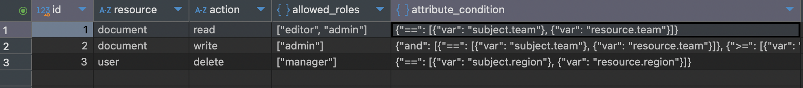

# @merncloud/permission-resolver

A lightweight, pluggable RBAC + ABAC permission resolver for Node.js and frontend apps.

✅ Role-Based Access  
✅ Attribute-Based Access  
✅ JSON Logic conditions  
✅ Flattened permissions  
✅ Works with any DB  
✅ Works in Node.js, NestJS, React, etc.

---

## 🔧 Installation

```bash
npm install @merncloud/permission-resolver
```

---

## 📦 Backend Usage

### 1. Initialize with Static Rules (e.g. from a local TS file)

```ts
// auth/customRules.ts
export const customPermissionRules = [
  {
    resource: "document",
    action: "read",
    allowedRoles: ["editor", "viewer"],
  },
  {
    resource: "document",
    action: "write",
    attributeCondition: {
      ">=": [{ var: "subject.attributes.level" }, 2],
    },
  },
];
```

```ts
// index.ts
import { PermissionService } from "@merncloud/permission-resolver";
import { customPermissionRules } from "./auth/customRules";

PermissionService.init(customPermissionRules);
const resolver = PermissionService.getInstance();

app.get("/permissions", async (req, res) => {
  try {
    const permissions = await resolver.getRules();
    res.json(permissions);
  } catch (error) {
    res.status(500).json({ error: "Failed to fetch permissions" });
  }
});
```

### 2. Initialize with Rules from Database

```ts
import { Pool } from "pg";
import {
  createResolverFromSource,
  PermissionService,
} from "@merncloud/permission-resolver";

const pool = new Pool({
  /* your pg config */
});

const resolver = await createResolverFromSource(async () => {
  const result = await pool.query("SELECT * FROM permissions");
  return result.rows.map((row) => ({
    resource: row.resource,
    action: row.action,
    allowedRoles: row.allowed_roles,
    attributeCondition: row.attribute_condition,
  }));
});

PermissionService.init(resolver.getRules());

///// You can create a RbacService class and use it like this

import { RowDataPacket } from "mysql2";
import { getDBPool } from "./db";
import { PermissionService } from "@merncloud/permission-resolver";

class RbacSingleton {
  private resolver: any = null;
  private isInitialized = false;
  private initPromise: Promise<any> | null = null;

  async init() {
    if (this.isInitialized) return this.resolver;
    if (this.initPromise) return this.initPromise;

    this.initPromise = this.doInit();
    return this.initPromise;
  }

  private async doInit() {
    try {
      // Fetch permissions from database
      const pool = getDBPool();
      const [rows] = await pool.query("SELECT * FROM permissions");
      const result = rows as RowDataPacket[];

      // Transform database rows to permission rules format
      const permissionRules = result.map((row) => ({
        resource: row.resource,
        action: row.action,
        allowedRoles: row.allowed_roles,
        attributeCondition: row.attribute_condition,
      }));

      // Initialize PermissionService with rules
      PermissionService.init(permissionRules);
      this.resolver = PermissionService.getInstance();
      this.isInitialized = true;

      console.log(
        "RBAC singleton initialized with",
        permissionRules.length,
        "rules"
      );
      return this.resolver;
    } catch (error) {
      this.initPromise = null; // Reset promise on error
      console.error("Failed to initialize RBAC singleton:", error);
      throw error;
    }
  }

  getResolver() {
    if (!this.isInitialized) {
      throw new Error("RBAC not initialized. Call rbacInstance.init() first.");
    }
    return this.resolver;
  }

  async reload() {
    this.isInitialized = false;
    this.initPromise = null;
    this.resolver = null;
    return await this.init();
  }
}

// Export singleton instance
export const rbacInstance = new RbacSingleton();

// index.ts
import { rbacInstance } from "./your-path/RbacSingleton";

await rbacInstance.init();

/// auth service
import { rbacInstance } from "../../../config/RbacSingleton";

export class AuthService {
  constructor() {}

  async getPermissions() {
    const resolver = rbacInstance.getResolver();
    const permissions = await resolver.getRules();
    return permissions;
  }
}

/// auth controller
import { Request, Response } from "express";
import { AuthService } from "../services/auth.service";

export class AuthController {
  constructor(private readonly authService: AuthService) {}

  getPermissions = async (req: Request, res: Response) => {
    const permissions = await this.authService.getPermissions();
    res.json(permissions);
  };
}
```



### 3. Create Middleware for Access Control

```ts
function canAccess(resourceType: string, action: string) {
  return (req, res, next) => {
    const resolver = PermissionService.getInstance();

    const subject = {
      id: req.user.id,
      roles: req.user.roles,
      attributes: req.user.attributes,
    };

    const resource = {
      id: req.params.id,
      type: resourceType,
      attributes: req.resourceAttributes, // e.g. loaded from DB
    };

    if (resolver.can(subject, resource, action)) {
      return next();
    } else {
      return res.status(403).json({ error: "Forbidden" });
    }
  };
}

// Example usage
app.get("/documents/:id", canAccess("document", "read"), (req, res) => {
  res.json({ message: "You can read this document" });
});
```

---

## 🖥️ Frontend Usage (React / SPA)

```ts
// index.tsx
import { initPermissionClient } from "@merncloud/permission-resolver/frontend";
import { apiClient } from "./services/apiService";

await initPermissionClient({
  fetchRules: () => apiClient.get("/permissions"),
});
```

---

### 📥 Use in React Component

```tsx
import { flatten } from "@merncloud/permission-resolver";
import { getPermissionClient } from "@merncloud/permission-resolver/frontend";

const subject = {
  id: "1",
  roles: ["user"],
  attributes: {
    team: "alpha",
    level: 4,
    region: "north",
  },
};

const resource = {
  id: "1",
  type: "document",
  attributes: {
    team: "alpha",
    region: "north",
  },
};

const Component = () => {
  const canRead = getPermissionClient().can(subject, resource, "read");
  const capabilities = flatten(subject, resource);

  return (
    <>
      {canRead && <p>You can read the document</p>}
      <p>Capabilities: {JSON.stringify(capabilities)}</p>
    </>
  );
};
```

---

## 🔁 Flattened Permissions

You can convert permissions into a flat list like:

```ts
["document:read", "document:write"];
```

Using:

```ts
import { flatten } from "@merncloud/permission-resolver";

const perms = flatten(subject, resource);
```

---

## 📐 Rule Format

Each rule supports:

```ts
{
  resource: string;
  action: string;
  allowedRoles?: string[];
  attributeCondition?: JsonLogicObject;
}
```

Example:

```ts
{
  resource: "document",
  action: "publish",
  allowedRoles: ["admin"],
  attributeCondition: {
    and: [
      { "==": [ { var: "subject.attributes.team" }, { var: "resource.attributes.team" } ] },
      { ">=": [ { var: "subject.attributes.level" }, 2 ] }
    ]
  }
}
```

---

## 🎯 Features

- Works with **any database**
- Supports **complex JSON logic**
- Uses a **singleton pattern** for backend `PermissionService`
- Frontend provides **cached client** with `getPermissionClient()`
- Compatible with **React**, **Express**, **NestJS**, **Next.js**, etc.
